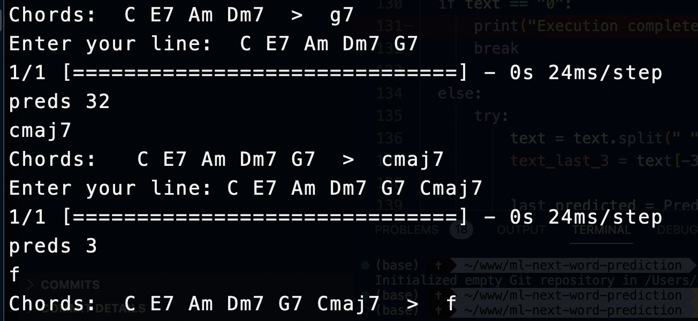

# Next chord prediction

Use Natural Language Processing to predict the next chord in a series, using a LSTM (long short-term memory) network.

Still missing to gather a proper data set, as well as test and fine-tune the model. However, it can be used in the current state and throw some interesting results.

- The chord progression: C E7 Am predicted Dm7 (not visible in screenshot)
- The chord progression: C E7 Am Dm7 results in the prediction of G7
- The chord progression: C E7 Am Dm7 G7 results in the prediction of Cmaj7
- The chord progression: C E7 Am Dm7 G7 Cmaj7 results in the prediction of F

This repo is based on this tutorial by 
IG Tech Team: https://www.youtube.com/watch?v=VB7bbFIEAhk